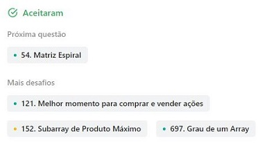
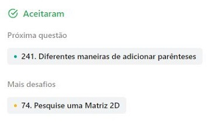
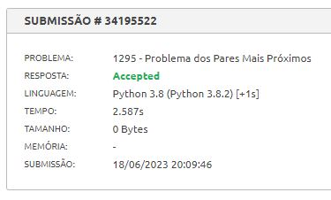
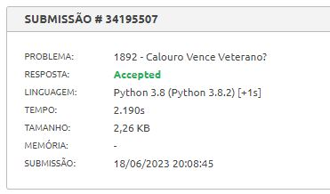
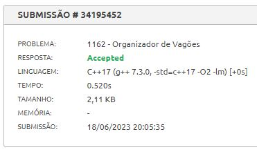

# Dividir_Conquistar_Exercicios_08

**Número da Lista**: 8 
**Conteúdo da Disciplina**: D&C 

## Alunos
| Matrícula | Aluno                              |
| --------- | ---------------------------------- |
| 211031664 | Catlen Cleane Ferreira de Oliveira |
| 212002907 | Zenilda Pedrosa Vieira             |

## Sobre 
Escolhemos 2 exercícios do LeetCode e 3 do Beecrowd sobre a matéria estudada. 

> Algoritmo Dividir e Conquistar - Nível Médio - [53 - Maximo Subarray](53/53_Maximo_Subarray.py) 
> Algoritmo Dividir e Conquistar - Nível Médio - [240 - Pesquise uma Matriz 2D II](240/240_Pesquise_uma_Matriz_2D_II.py) 
> Algoritmo do Par Mais Próximo - Nível 9 - [1295 - Problema dos Pares Mais Próximos](1295/1295_Problema_dos_Pares_Mais_Proximos.py) 
> Algoritmo de Contagem de Inversões - Nível 9 - [1892 - Calouro vence Veterano?](1892/1892_Calouro_Vence_Veterano.py) 
> Algoritmo Dividir e Conquistar - Nível 5 - [1162 - Organizador de Vagões](1162/1162_Organizador_de_Vagoes.cpp) 

## Screenshots

 

 

## Vídeo explicativo

[Apresentacao_D&C.mp4](Apresentacao_D&C.mp4)

## Instalação 
**Linguagens**: Python 

## Uso 
Os exemplos do Beecrowd:

Para rodar basta clonar o repositório e usar o comando no terminal (dentro da pasta do arquivo):

    python3 nome_arquivo.py < nome_arq_entradas.txt

ou (para o código em C++)
    
    g++ -o nome_arquivo nome_arquivo.cpp
    ./nome_arquivo < nome_arquivo_entrada.txt

Outra forma de verificar o código é submetê-lo ao juiz do Beecrowd:

[Beecrowd - 1295 - Problema dos Pares Mais Próximos](https://www.beecrowd.com.br/judge/pt/problems/view/1295) 
[Beecrowd - 1892 - Calouro vence Veterano?](https://www.beecrowd.com.br/judge/pt/problems/view/1892) 
[Beecrowd - 1162 - Organizador de Vagões](https://www.beecrowd.com.br/judge/pt/problems/view/1162) 

Os exemplos do LeetCode devem ser submetidos no juiz do site:

[LeetCode - 53 - Maximo Subarray](https://leetcode.com/problems/maximum-subarray/description/) 
[LeetCode - 240 - Pesquise uma Matriz 2D II](https://leetcode.com/problems/search-a-2d-matrix-ii/description/) 

    
